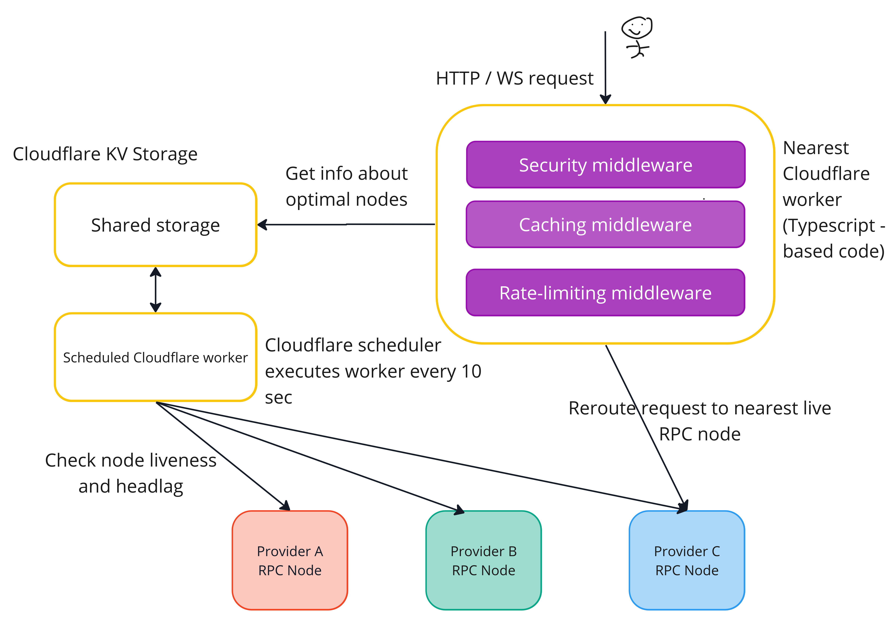

<div align="center">
  <h1 align="center">The Unstoppable RPC Endpoint</h1>

  <p align="center">
    The Unstoppable RPC Endpoint: Aggregating RPC endpoints for improved availability, low latency, and enhanced security. 
    Open source and accessible to all DApp projects.
  </p>
</div>


## Architecture

Solution is based on [Cloudflare Workers](https://workers.cloudflare.com/), using Cloudflare KV Storage plugin and Cloudflare Caching API.



## Getting Started

### Installation

1. Install npm and yarn locally
2. Create Cloudflare account
3. Install dependencies

```bash
yarn install
```

4. Login into wrangler locally

```bash
yarn run wrangler login
```

### Node list configuration

1. Create KV namespace in Cloudflare KV

* for development create preview KV

```shell
yarn run wrangler kv:namespace create CONFIG_KV --preview
```

* for production create regular KV

```shell
yarn run wrangler kv:namespace create CONFIG_KV
```

2. Prepare node list data with your list of endpoints

Example and structure could be found in [node-config-example.json](node-config-example.json)

Tips:

* you can specify coordinates of node to get geo routing benefits and minimize latency
    * this info could be extracted from IP by external services such [IP Info](https://ipinfo.io/)

3. Enter node list data into created KV namespace

* go to Cloudflare UI -> Workers KV page
* select your created namespace
* create new item(entry) into namespace
    * key - `origin`
    * value - valid JSON as array, example could be found in [node-config-example.json](node-config-example.json).

### Develop

1. Make sure KV namespace is created and node list is configured
2. Run web server locally

```shell
yarn run wrangler dev
```

### Publish

1. Make sure KV namespace is created and node list is configured
2. Publish worker code to Cloudflare Workers

```shell
yarn run wrangler publish
```

## Acknowledgments

The project was done for [ETH Belgrade hackathon 2023](https://taikai.network/ethbelgrade/hackathons/hackathon-2023)

Team members:

* [Vasily Rudomanov](https://www.linkedin.com/in/vrudomanov/)
* [Andrey Larionov](https://www.linkedin.com/in/alarionov/)
* [Nikita Iugov](https://www.linkedin.com/in/nikita-yugov/)
